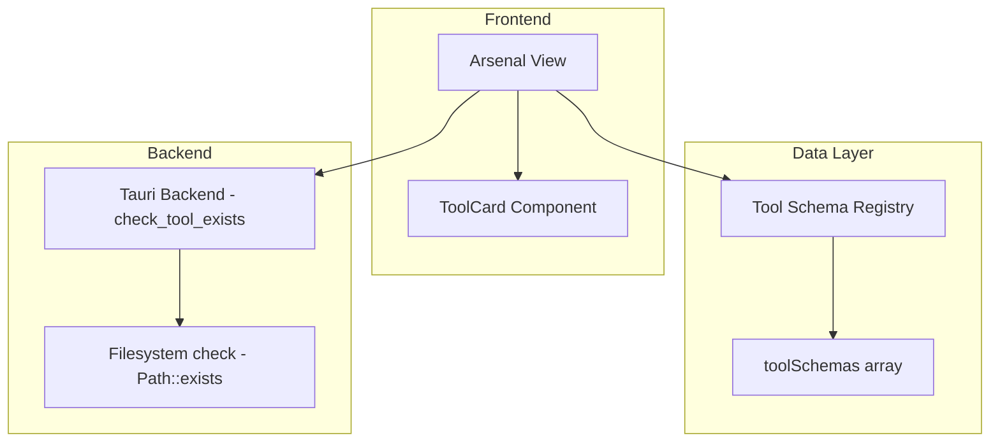

# Design Document: Arsenal View

## Overview

The Arsenal View is the landing dashboard for CrackNTTy, presenting all registered pentesting tools as interactive cards in a responsive grid. It integrates with the Tauri backend to detect tool binary availability on the host system, and provides client-side filtering by category and text search. The implementation uses React 19 with TypeScript, Zustand-free local state (useState/useEffect), and Tailwind CSS v4 for styling within the app's dark design system.

## Architecture

The Arsenal View follows a simple single-component architecture with one child component:



**Data flow:**
1. `Arsenal` imports `toolSchemas` from the schema registry (static data)
2. On mount, `Arsenal` invokes `check_tool_exists` via Tauri IPC for each tool's path
3. Status results are stored in local component state as a `Record<string, ToolStatus>`
4. User interactions (filter pills, search input) update local state, triggering re-renders that filter the displayed tools
5. Each `ToolCard` receives its schema and status as props

**Key architectural decisions:**
- Local state (useState) rather than Zustand store — tool statuses are transient UI state scoped to this view, not shared across the app
- Parallel async checks via `Promise.all` for fast status resolution
- Pure client-side filtering (no backend query needed since the full schema registry is small and static)

## Components and Interfaces

### Arsenal Component (`src/views/Arsenal.tsx`)

The parent view component responsible for layout, state management, and filtering logic.

**State:**
- `filter: FilterCategory` — active category pill (`'All Tools' | Category`)
- `search: string` — current search input text
- `statuses: Record<string, ToolStatus>` — maps tool IDs to detected status
- `loading: boolean` — true while status checks are in progress

**Behavior:**
- On mount: runs parallel `check_tool_exists` invocations for all tools
- Filtering: combines category filter AND search filter (case-insensitive match on name/description)
- Renders header with tool count and active count, filter pills row, search input, and the tool card grid

### ToolCard Component (`src/components/ToolCard.tsx`)

A presentational component rendering a single tool card.

**Props:**
```typescript
interface ToolCardProps {
  schema: ToolSchema
  status: ToolStatus
  statusLoading: boolean
  onConfigure: (toolId: string) => void
}
```

**Rendering sections:**
- Header row: emoji icon (left) + category badge (right)
- Body: tool name (bold) + description (muted)
- Footer: status dot + label (left) + "Configure →" button (right)

### Filter Pills

Inline buttons within Arsenal. Each displays the category name and tool count in parentheses. Active pill gets blue accent styling, inactive pills get slate styling.

### Search Input

A controlled text input in the top-right of the filter row. Filters are applied on every keystroke (no debounce needed given the small dataset of 7 tools).

## Data Models

### ToolSchema (existing, from `src/schemas/types.ts`)

```typescript
interface ToolSchema {
  id: string
  name: string
  icon: string          // Emoji
  category: Category    // 'Reconnaissance' | 'Exploitation' | 'Analysis'
  description: string
  command: string
  path: string          // Absolute binary path for existence check
  args: ArgDef[]
  outputFormat: string
  parserType: ParserType
}
```

### ToolStatus (existing, from `src/schemas/types.ts`)

```typescript
type ToolStatus = 'active' | 'idle'
```

### FilterCategory (local to Arsenal)

```typescript
type FilterCategory = 'All Tools' | Category
```

### Status Map (local state)

```typescript
// Record mapping tool ID → detected status
Record<string, ToolStatus>
```

### Tauri IPC Interface

```typescript
// Invoke signature
invoke<boolean>('check_tool_exists', { path: string }) => Promise<boolean>
```

## Correctness Properties

*A property is a characteristic or behavior that should hold true across all valid executions of a system — essentially, a formal statement about what the system should do. Properties serve as the bridge between human-readable specifications and machine-verifiable correctness guarantees.*

### Property 1: Category filter preserves category membership

*For any* set of tools and any selected category (not "All Tools"), every tool displayed after filtering SHALL have a `category` field equal to the selected category.

**Validates: Requirements 3.2**

### Property 2: Search filter matches name or description

*For any* non-empty search string and any tool in the filtered result set, the tool's name (lowercased) or description (lowercased) SHALL contain the search string (lowercased).

**Validates: Requirements 4.2**

### Property 3: Combined filters are conjunctive

*For any* combination of a category filter and a search string, a tool appears in the result set if and only if it matches both the category condition AND the search condition.

**Validates: Requirements 4.4**

### Property 4: "All Tools" filter is identity

*For any* tool schema registry, selecting "All Tools" with an empty search string SHALL produce a result set equal to the full registry.

**Validates: Requirements 3.3**

### Property 5: Status mapping preserves tool count

*For any* tool schema registry, after all status checks complete, the status map SHALL contain exactly one entry per tool in the registry (total count invariant).

**Validates: Requirements 2.1**

### Property 6: Status reflects binary existence

*For any* tool where `check_tool_exists(path)` returns true, the corresponding status SHALL be 'active'; where it returns false, the status SHALL be 'idle'.

**Validates: Requirements 2.2, 2.3**

## Error Handling

| Scenario | Behavior |
|----------|----------|
| `check_tool_exists` IPC fails for a tool | Catch error, set tool status to `'idle'` (safe fallback) |
| All IPC calls fail (backend unreachable) | All tools show 'idle' status; no crash |
| Empty schema registry | Grid renders empty; no error |
| Search yields no results | Empty state message: "No tools match your filters." |

Error handling is deliberately minimal since:
- The schema registry is static compile-time data (no runtime fetch failures)
- The only external call (`check_tool_exists`) has a clear safe fallback
- UI state is entirely local — no store corruption risk

## Testing Strategy

### Unit Tests (Example-based)
- Verify `ToolCard` renders correct elements given various prop combinations
- Verify filter pill active state styling
- Verify empty state renders when no tools match

### Property-Based Tests
- **Library:** fast-check (TypeScript)
- **Minimum iterations:** 100 per property
- Tests the filtering logic as a pure function extracted from the component:
  - Generate arbitrary tool arrays and filter parameters
  - Assert properties 1–6 hold across all generated inputs

### Integration Tests
- Mount Arsenal with mocked `invoke` → verify correct number of cards render
- Simulate category pill click → verify grid updates
- Simulate search input → verify grid updates
- Verify loading state appears during status checks

### Test Configuration
- Framework: Vitest
- Component testing: @testing-library/react
- PBT library: fast-check
- Each property test tagged with: `Feature: arsenal-view, Property {N}: {title}`
