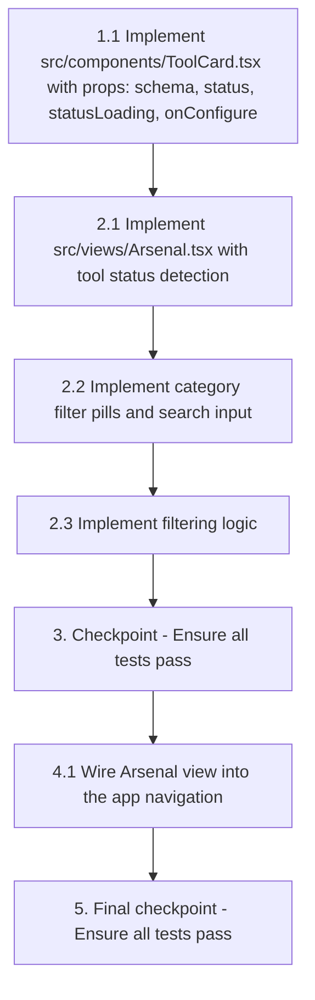

# Implementation Plan: Arsenal View

## Overview

Implement the Arsenal View — the tool inventory dashboard for CrackNTTy. This involves a parent `Arsenal` component that fetches tool availability from the Tauri backend and provides category/search filtering, and a child `ToolCard` component that renders individual tool cards. The implementation uses React 19, TypeScript, Tailwind CSS v4, and Tauri 2 IPC.

## Tasks

- [x] 1. Create the ToolCard component
  - [x] 1.1 Implement `src/components/ToolCard.tsx` with props: `schema`, `status`, `statusLoading`, `onConfigure`
    - Render tool icon (top-left), category badge (top-right), name, description
    - Render status dot (green for active, gray for idle, pulsing for loading) + status label
    - Render "Configure →" button that calls `onConfigure(schema.id)`
    - Use dark card styling: bg-[#1a1f2e], border-slate-700, rounded-lg, hover shadow transition
    - _Requirements: 1.3, 2.2, 2.3, 2.4, 5.1, 5.2, 6.2, 6.3_

  - [ ]* 1.2 Write unit tests for ToolCard
    - Test renders all schema fields (icon, category, name, description)
    - Test active status shows green dot and "Active" text
    - Test idle status shows gray dot and "Idle" text
    - Test loading state shows pulsing indicator
    - Test onConfigure callback fires with correct tool ID
    - _Requirements: 1.3, 2.2, 2.3, 2.4, 5.2_

- [x] 2. Implement the Arsenal view component
  - [x] 2.1 Implement `src/views/Arsenal.tsx` with tool status detection
    - Import `toolSchemas` from schema registry
    - On mount, call `invoke('check_tool_exists', { path })` for each tool via `Promise.all`
    - Store results in `statuses: Record<string, ToolStatus>` state
    - Track `loading` boolean for status check progress
    - Render header with tool count and active count
    - _Requirements: 1.1, 2.1, 2.4_

  - [x] 2.2 Implement category filter pills and search input
    - Render filter pills for "All Tools", "Reconnaissance", "Exploitation", "Analysis" with counts
    - Active pill: blue accent styling (bg-blue-500/20, text-blue-400, border-blue-500/50)
    - Inactive pills: slate styling with hover states
    - Search input: right-aligned, bg-slate-800, border-slate-700, focus:border-blue-500
    - _Requirements: 3.1, 3.4, 4.1, 6.4_

  - [x] 2.3 Implement filtering logic
    - Filter tools by category (or show all when "All Tools" selected)
    - Filter by search text (case-insensitive match on name or description)
    - Apply both filters simultaneously (conjunction)
    - Render filtered Tool_Cards in responsive grid (grid-cols-1 sm:2 lg:3 xl:4)
    - Show empty state "No tools match your filters." when no results
    - _Requirements: 1.2, 3.2, 3.3, 4.2, 4.3, 4.4_

  - [ ]* 2.4 Write property tests for filtering logic
    - **Property 1: Category filter preserves category membership**
    - **Validates: Requirements 3.2**
    - **Property 2: Search filter matches name or description**
    - **Validates: Requirements 4.2**
    - **Property 3: Combined filters are conjunctive**
    - **Validates: Requirements 4.4**
    - **Property 4: "All Tools" filter is identity**
    - **Validates: Requirements 3.3**

  - [ ]* 2.5 Write property tests for status detection
    - **Property 5: Status mapping preserves tool count**
    - **Validates: Requirements 2.1**
    - **Property 6: Status reflects binary existence**
    - **Validates: Requirements 2.2, 2.3**

- [x] 3. Checkpoint - Ensure all tests pass
  - Ensure all tests pass, ask the user if questions arise.

- [x] 4. Integration and styling verification
  - [x] 4.1 Wire Arsenal view into the app navigation
    - Verify Arsenal is imported and rendered in `src/App.tsx` tab navigation
    - Verify dark background (#0f1117) applied to main content area
    - Verify responsive grid adapts correctly across breakpoints
    - _Requirements: 1.2, 6.1_

  - [ ]* 4.2 Write integration tests for Arsenal view
    - Mount Arsenal with mocked Tauri invoke
    - Verify correct number of cards render for full registry
    - Simulate category pill click → verify grid updates
    - Simulate search input → verify grid updates
    - Verify loading state during status checks
    - _Requirements: 1.1, 2.4, 3.2, 4.2_

- [x] 5. Final checkpoint - Ensure all tests pass
  - Ensure all tests pass, ask the user if questions arise.

## Task Dependency Graph

## Notes

- Tasks marked with `*` are optional and can be skipped for faster MVP
- The implementation already exists — tasks document the structure for traceability
- Property tests use `fast-check` library with minimum 100 iterations per property
- The filtering logic can be extracted as a pure function for easy property testing
- Each property test should be tagged: `Feature: arsenal-view, Property {N}: {title}`
