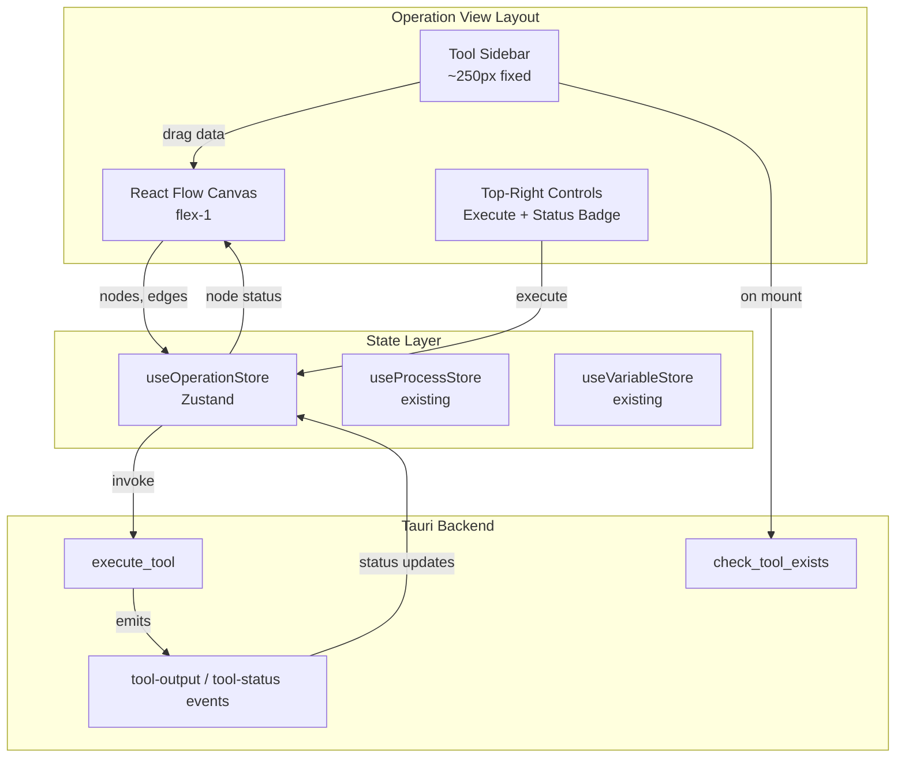
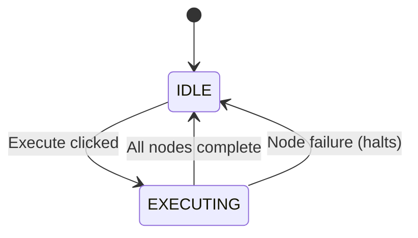

# Design Document: Operation View

## Overview

The Operation View is a React Flow-based pipeline canvas that transforms CrackNTTy into a visual pentesting orchestrator. It consists of three main regions: a left sidebar listing draggable tools, a central canvas where nodes are placed and connected, and a top-right control area for execution and status. The implementation leverages @xyflow/react v12 for the graph rendering engine, Zustand for pipeline state management, and Tauri IPC for tool availability checks and execution.

## Architecture



### Data Flow

1. **Tool Discovery**: On mount, sidebar calls `check_tool_exists` for each schema path. Only tools that exist are rendered.
2. **Node Creation**: User drags a tool from sidebar → drops on canvas → `onDrop` handler reads toolId from dataTransfer, creates a node at drop position.
3. **Connection**: User drags between handles → `onConnect` adds an edge.
4. **Execution**: User clicks "Execute Operation" → topological sort determines order → each tool is invoked sequentially via Tauri's `execute_tool` → status events update node states in real time.

## Components and Interfaces

### File Structure

```
src/
├── views/
│   └── Operation.tsx          # Main view: layout shell with sidebar + canvas
├── components/
│   ├── ToolNode.tsx           # Custom React Flow node component
│   ├── ToolSidebar.tsx        # Left sidebar with draggable tool items
│   └── OperationControls.tsx  # Execute button + status badge overlay
└── stores/
    └── operationStore.ts      # Zustand store for pipeline state
```

### ToolSidebar Component

```tsx
// src/components/ToolSidebar.tsx
interface ToolSidebarProps {
  tools: ToolSchema[]  // filtered to active-only
}
```

Responsibilities:
- Groups tools by category using a mapping from schema `Category` to display labels ("Reconnaissance" → "Active Recon", "Exploitation" → "Exploit Modules", "Analysis" → "Credential Harvesting")
- Renders each tool as a draggable item with `draggable="true"`
- Sets `event.dataTransfer.setData('application/crackntty-tool', toolId)` on dragStart
- Styled with fixed width, dark theme background, vertical scroll for overflow

### ToolNode Component

```tsx
// src/components/ToolNode.tsx
import { Handle, Position, type NodeProps } from '@xyflow/react'

type ToolNodeData = {
  toolId: string
  schema: ToolSchema
  config: Record<string, string | boolean>
  status: 'idle' | 'running' | 'completed' | 'failed'
}
```

Responsibilities:
- Renders tool icon (emoji from schema), name, category badge
- Shows status indicator: colored dot (gray=idle, blue-pulse=running, green=completed, red=failed)
- Left `Handle` with type="target", right `Handle` with type="source"
- "..." button that toggles a dropdown menu with Delete, Configure, Duplicate options
- Styled with card background (#1a1f2e), border-slate-700, rounded corners

### OperationControls Component

```tsx
// src/components/OperationControls.tsx
interface OperationControlsProps {
  status: OperationStatus
  onExecute: () => void
  disabled: boolean
}
```

Responsibilities:
- "Execute Operation" button: red background (#dc2626), white text, disabled during EXECUTING
- Status badge: pill-shaped with status text and color coding (IDLE=slate, ARMING=amber, EXECUTING=red pulse)
- Positioned absolutely in top-right of canvas area

### Operation View (Main Layout)

```tsx
// src/views/Operation.tsx
```

Responsibilities:
- Horizontal flex layout: Sidebar (fixed 250px) | Canvas (flex-1)
- Houses the ReactFlow provider and canvas instance
- Manages `onDragOver`, `onDrop`, `onConnect` handlers
- Renders Background (dot variant), Controls, MiniMap
- Passes `nodeTypes` with custom ToolNode registration

### Operation Store

```tsx
// src/stores/operationStore.ts
type OperationStatus = 'IDLE' | 'ARMING' | 'EXECUTING'

interface OperationState {
  nodes: Node<ToolNodeData>[]
  edges: Edge[]
  status: OperationStatus
  
  // Actions
  setNodes: (nodes: Node<ToolNodeData>[]) => void
  setEdges: (edges: Edge[]) => void
  onNodesChange: OnNodesChange
  onEdgesChange: OnEdgesChange
  addNode: (node: Node<ToolNodeData>) => void
  removeNode: (nodeId: string) => void
  duplicateNode: (nodeId: string) => void
  addEdge: (edge: Edge) => void
  updateNodeStatus: (nodeId: string, status: ToolNodeData['status']) => void
  setOperationStatus: (status: OperationStatus) => void
  executeOperation: () => Promise<void>
}
```

Responsibilities:
- Central state for the pipeline graph (nodes + edges)
- Integrates with React Flow's change handlers via `applyNodeChanges` / `applyEdgeChanges`
- `executeOperation()`: runs topological sort, iterates nodes in order, invokes Tauri `execute_tool`, listens to status events, updates node statuses
- On execution failure: marks failed node, stops execution, resets operation status

## Data Models

### ToolNodeData

```typescript
type ToolNodeData = {
  toolId: string
  schema: ToolSchema              // full schema reference
  config: Record<string, string | boolean>  // user-configured arg values
  status: 'idle' | 'running' | 'completed' | 'failed'
}
```

### Node Identity

Each node gets a unique ID generated via `crypto.randomUUID()` at creation time. The `toolId` field within data references the schema, allowing multiple instances of the same tool on the canvas.

### Category Display Mapping

```typescript
const categoryDisplayMap: Record<Category, string> = {
  'Reconnaissance': 'Active Recon',
  'Exploitation': 'Exploit Modules',
  'Analysis': 'Credential Harvesting',
}
```

### Operation Status State Machine



Note: ARMING is reserved for future use when pre-execution validation or configuration checks are added. For now, transitions are IDLE ↔ EXECUTING.

## Error Handling

| Scenario | Handling |
|----------|----------|
| Tool binary not found on disk | Tool excluded from sidebar (check_tool_exists returns false) |
| Drop with invalid/missing transfer data | onDrop handler exits early, no node created |
| Pipeline has cycle | topologicalSort throws, execution blocked, user notified via status |
| Tool execution fails (non-zero exit) | Node marked "failed", downstream nodes stay "idle", operation status returns to IDLE |
| Empty pipeline (no nodes) | Execute button disabled when no nodes exist |
| Disconnected nodes in pipeline | Topological sort still works — disconnected nodes execute as independent roots |

## Testing Strategy

Property-based testing is **not applicable** for this feature. The Operation View is primarily a UI composition layer integrating React Flow components with Tauri IPC. The logic is:
- React event handlers (drag/drop) — tested with example-based interaction tests
- React Flow API wrappers (addEdge, removeNodes) — thin pass-throughs
- Zustand state transitions — tested with example-based unit tests
- Tauri command invocations — tested with integration mocks

The one pure algorithm (topological sort in `src/lib/pipeline.ts`) is already implemented and would be a candidate for PBT, but it's existing code outside this feature's scope.

**Testing approach:**
- **Unit tests**: Verify store actions (addNode, removeNode, duplicateNode, updateNodeStatus, status transitions)
- **Component tests**: Verify sidebar renders correct tools, ToolNode renders all elements, drag/drop creates nodes
- **Integration tests**: Mock Tauri invoke to test execution flow end-to-end

**Framework**: Vitest + React Testing Library (to be added when test infrastructure is set up)
